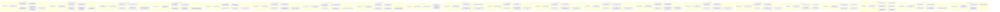

```mermaid
flowchart TD
    subgraph Dashboard["Dashboard (Root Files)"]
        D1[/inventory/dashboard route/] --> D2["Dashboard pages load cards and recent transactions"]
        D2 --> D3["GET /api/inventory/dashboard/stats"]
        D3 --> D4["DashboardController@getStats"]
        D2 --> D5["Card clicks navigate to items, alerts, adjustments, transfers, transactions"]
    end

    subgraph Stocks["Stocks Folder (Stocks/)"]
        S1[/inventory/items route/] --> S2["List inventory table with search/filter"]
        S2 --> S3["GET /api/inventory/items"]
        S3 --> S4["BranchInventoryController@index"]
        S2 --> S5["Update stock/status actions"]
        S5 --> S6["POST /api/inventory/items/{id}/update-status"]
        S6 --> S7["BranchInventoryController@updateStatus"]
    end

    subgraph Products["Products Folder (Products/)"]
        P1[/inventory/products/] --> P2["List, filter, open detail, delete"]
        P2 --> P3["GET /api/inventory/products"]
        P3 --> P4["ProductController@index"]
        P2 --> P5["GET /api/inventory/products/{id}"]
        P5 --> P6["ProductController@show"]
        P2 --> P7["POST PUT DELETE /api/inventory/products/{id}"]
        P7 --> P8["ProductController@store update destroy"]
    end

    subgraph Categories["Categories Folder (Categories/)"]
        C1[/inventory/categories/] --> C2["List/search categories and open detail"]
        C2 --> C3["GET /api/inventory/categories"]
        C3 --> C4["CategoryController@index"]
        C2 --> C5["POST PUT DELETE /api/inventory/categories/{id}"]
        C5 --> C6["CategoryController@store update destroy"]
    end

    subgraph Units["Units Folder (Units/)"]
        U1[/inventory/units/] --> U2["List units and open create detail edit"]
        U2 --> U3["GET /api/inventory/units"]
        U3 --> U4["UnitController@index"]
        U2 --> U5["POST PUT DELETE /api/inventory/units/{id}"]
        U5 --> U6["UnitController@store update destroy"]
    end

    subgraph StockIssues["Stock Issues Folder (StockIssues/)"]
        I1[/inventory/stock-issues/] --> I2["List create edit detail stock issues"]
        I2 --> I3["GET POST PUT DELETE /api/inventory/issues/{id}"]
        I3 --> I4["StockIssueController@index show store update destroy"]
        I2 --> I5["Approve or reject issue"]
        I5 --> I6["POST /api/inventory/issues/{id}/approve reject"]
        I6 --> I7["StockIssueController@approve reject"]
    end

    subgraph StockReturns["Stock Returns Folder (StockReturns/)"]
        R1[/inventory/stock-returns/] --> R2["List create edit detail returns"]
        R2 --> R3["GET POST PUT DELETE /api/inventory/returns/{id}"]
        R3 --> R4["StockReturnController@index show store update destroy"]
        R2 --> R5["Approve reject receive return"]
        R5 --> R6["POST /api/inventory/returns/{id}/approve reject receive"]
        R6 --> R7["StockReturnController@approve reject receive"]
    end

    subgraph StockCounts["Stock Counts Folder (StockCounts/)"]
        SC1[/inventory/stock-counts/] --> SC2["List and manage stock count sessions"]
        SC2 --> SC3["GET POST PUT DELETE /api/inventory/counts/{id}"]
        SC3 --> SC4["StockCountController@index show store update destroy"]
        SC2 --> SC5["Start update-counts complete approve"]
        SC5 --> SC6["POST /api/inventory/counts/{id}/start update-counts complete approve"]
        SC6 --> SC7["StockCountController@start updateCounts complete approve"]
    end

    subgraph Adjustments["Adjustments Folder (Adjustments/)"]
        A1[/inventory/adjustments/] --> A2["List create view adjustments"]
        A2 --> A3["GET POST /api/inventory/adjustments"]
        A3 --> A4["StockAdjustmentController@index store"]
        A2 --> A5["Submit approve reject"]
        A5 --> A6["POST /api/inventory/adjustments/{id}/submit approve reject"]
        A6 --> A7["StockAdjustmentController@submit approve reject"]
    end

    subgraph Transfers["Transfers Folder (Transfers/)"]
        T1[/inventory/transfers/] --> T2["List create view transfer"]
        T2 --> T3["GET POST /api/inventory/transfers"]
        T3 --> T4["StockTransferController@index store"]
        T2 --> T5["Approve ship receive cancel"]
        T5 --> T6["POST /api/inventory/transfers/{id}/approve ship receive cancel"]
        T6 --> T7["StockTransferController@approve ship receive cancel"]
    end

    subgraph Alerts["Alerts Folder (Alerts/)"]
        AL1[/inventory/alerts/] --> AL2["List active alerts and stats"]
        AL2 --> AL3["GET /api/inventory/alert-management and /statistics"]
        AL3 --> AL4["AlertController@index statistics"]
        AL2 --> AL5["Acknowledge or resolve"]
        AL5 --> AL6["POST /api/inventory/alert-management/{id}/acknowledge resolve"]
        AL6 --> AL7["AlertController@acknowledge resolve"]
    end

    subgraph Transactions["Transactions Folder (Transactions/)"]
        TR1[/inventory/transactions/] --> TR2["List and summarize inventory transactions"]
        TR2 --> TR3["GET /api/inventory/transactions"]
        TR3 --> TR4["InventoryTransactionController@index"]
        TR2 --> TR5["GET /api/inventory/transactions/summary chart export"]
        TR5 --> TR6["InventoryTransactionController@summary chartData export"]
    end

    subgraph Reports["Reports Folder (Reports/)"]
        RP1[/inventory/reports/] --> RP2["Pick report type and filters"]
        RP2 --> RP3["GET /api/inventory/reports/*"]
        RP3 --> RP4["InventoryReportController branchSummary storeSummary movements valueByCategory slowMovers fastMovers transfers aging"]
    end

    subgraph Notifications["Notifications Folder (Notifications/)"]
        N1[/inventory/notifications/] --> N2["List unread and all notifications"]
        N2 --> N3["GET /api/inventory/notifications and /unread"]
        N3 --> N4["NotificationController@index getUnread"]
        N2 --> N5["Mark read mark-all delete batch-delete"]
        N5 --> N6["PUT DELETE POST /api/inventory/notifications/*"]
        N6 --> N7["NotificationController@markAsRead markAllAsRead delete batchDelete"]
    end

    subgraph Configuration["Configuration Folder (Configuration/)"]
        CF1[/inventory/configuration/] --> CF2["Load configuration + schema in form"]
        CF2 --> CF3["GET /api/inventory/configuration and /schema"]
        CF3 --> CF4["InventoryConfigurationController@show schema"]
        CF2 --> CF5["Save updated settings"]
        CF5 --> CF6["PUT /api/inventory/configuration"]
        CF6 --> CF7["InventoryConfigurationController@update"]
    end

    subgraph Warehouses["Warehouses Folder (Warehouses/)"]
        W1[/inventory/warehouses/] --> W2["Warehouse CRUD pages"]
        W2 --> W3["GET POST PUT DELETE /api/inventory/warehouses/{id}"]
        W3 --> W4["WarehouseController@index show store update destroy"]
        W2 --> W5["Load stats types capacity utilization"]
        W5 --> W6["GET /api/inventory/warehouses/types stats capacity-utilization"]
        W6 --> W7["WarehouseController@getTypes getStats getCapacityUtilization"]
    end

    subgraph Locations["Locations Folder (Locations/)"]
        L1[/inventory/locations/] --> L2["Location CRUD pages"]
        L2 --> L3["GET POST PUT DELETE /api/inventory/locations/{id}"]
        L3 --> L4["LocationController@index show store update destroy"]
        L2 --> L5["Load available update stock"]
        L5 --> L6["GET /available POST /{id}/update-stock"]
        L6 --> L7["LocationController@getAvailable updateStock"]
    end

    subgraph ReorderRules["Reorder Rules Folder (ReorderRules/)"]
        RR1[/inventory/reorder-rules/] --> RR2["Rules CRUD and status management"]
        RR2 --> RR3["GET POST PUT DELETE /api/inventory/reorder-rules/{id}"]
        RR3 --> RR4["ReorderRuleController@index show store update destroy"]
        RR2 --> RR5["Check status generate suggestions bulk priority"]
        RR5 --> RR6["POST /check-status /generate-suggestions /bulk-update-priority"]
        RR6 --> RR7["ReorderRuleController@checkReorderStatus generateSuggestions bulkUpdatePriority"]
    end

    subgraph ReorderSuggestions["Reorder Suggestions Folder (ReorderSuggestions/)"]
        RS1[/inventory/reorder-suggestions/] --> RS2["List and detail suggestions"]
        RS2 --> RS3["GET /api/inventory/reorder-suggestions and /{id}"]
        RS3 --> RS4["ReorderSuggestionController@index show"]
        RS2 --> RS5["Approve reject implement cancel bulk actions"]
        RS5 --> RS6["POST /{id}/approve reject implement cancel and /bulk-*"]
        RS6 --> RS7["ReorderSuggestionController@approve reject implement cancel bulkApprove bulkReject"]
    end

    subgraph SerialNumbers["Serial Numbers Folder (SerialNumbers/)"]
        SN1[/inventory/serial-numbers/] --> SN2["Serial number CRUD and lifecycle actions"]
        SN2 --> SN3["GET POST PUT DELETE /api/inventory/serial-numbers/{id}"]
        SN3 --> SN4["SerialNumberController@index show store update destroy"]
        SN2 --> SN5["Sell reserve unreserve damaged return move transfer import"]
        SN5 --> SN6["POST /sell reserve unreserve mark-damaged return move-location transfer bulk-import"]
        SN6 --> SN7["SerialNumberController lifecycle methods"]
    end

    subgraph Batches["Batches Folder (Batches/)"]
        B1[/inventory/batches/] --> B2["Batch CRUD and stock lifecycle actions"]
        B2 --> B3["GET POST PUT DELETE /api/inventory/batches/{id}"]
        B3 --> B4["BatchController@index show store update destroy"]
        B2 --> B5["Reserve sell return damaged move quality quarantine transfer import"]
        B5 --> B6["POST /reserve-stock sell-stock return-stock mark-damaged move-location approve-quality reject-quality quarantine transfer bulk-import"]
        B6 --> B7["BatchController lifecycle methods"]
    end
```